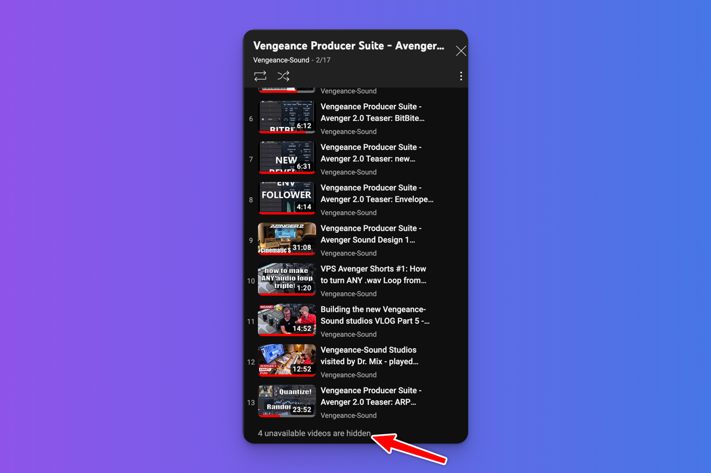

# WebsiteChecker

> _Calling this WebSiteChecker for lack of a better name_. 🙄 

### Backstory  

I am eagerly awaiting the release of a new version of a synthesizer plugin I'm fond of, called VPS Avenger.

Someone in the user group mentioned that videos likely showcasing new features and more have been uploaded to the company's YouTube channel that makes the synth.

As you can see, the text is at the bottom of the Playlist.

#### Problem

Selenium CSS selectors do not work on this YouTube page because it seems the content data is also loaded within a script tag, assigning a large JSON object to a JavaScript object that I assume is lazy-loaded. This would cause the Selenium selector to fail when attempting to select the element containing our text.

### Solution

Render the page and match the text we are checking to see if it has changed.
